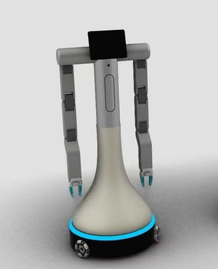
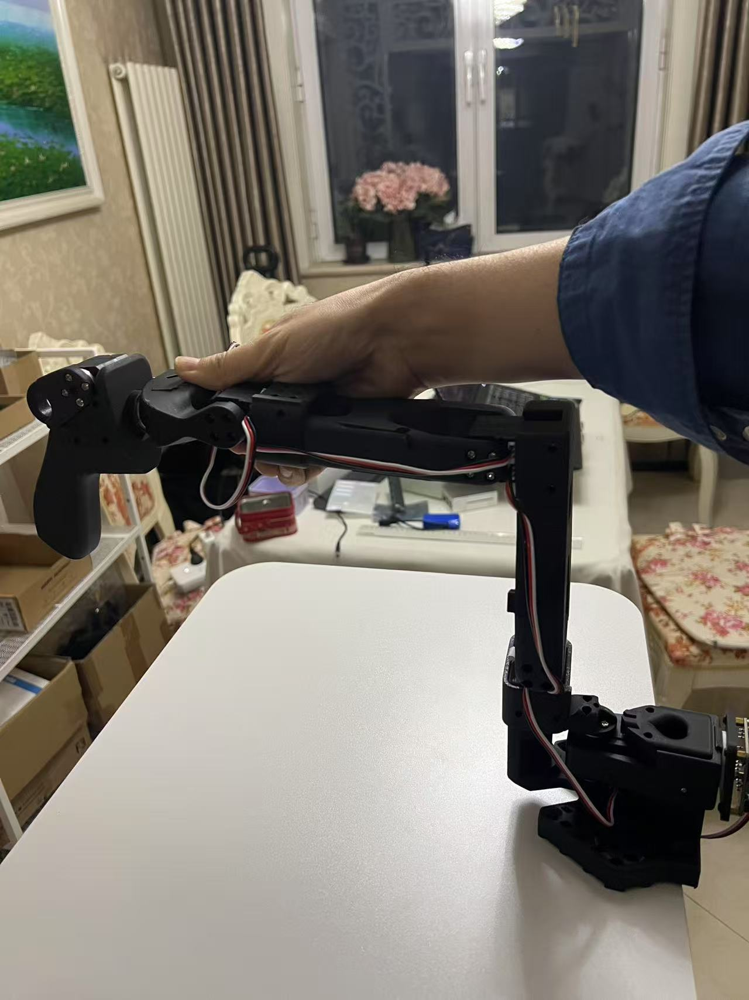

## English | [中文说明](docs/cn/1_新手指南.md)

2025-05-08 Update:  
Added support for dual-arm LeKiwi

## Preface

Compared to the original lerobot, **lerobot_alohamini** significantly enhances debugging capabilities and has been adapted to support the dual-arm version of LeKiwi as well as the upcoming AlohaMini robot hardware.

For details on the enhanced debugging features, see:  
[Debug Commands Summary](3_debug命令汇总.md)

About the upcoming AlohaMini hardware  
*(Estimated price under $2000 USD; contact the author on WeChat to pre-order: liyiteng or Email：liyiteng（at）gmail.com)*  



**Note**: This tutorial uses the SO100 (1 master + 1 slave) configuration as an example.


## Getting Started (Ubuntu System)

*** It is strongly recommended to follow the steps in order. ***

### 1. Preparation and Network Testing
```bash
curl https://www.google.com
curl https://huggingface.co
```
Ensure the network is accessible.

### 2. Clone the `lerobot_alohamini` Repository
```bash
cd ~
git clone https://github.com/liyitenga/lerobot_alohamini.git
```

### 3. Serial Port Authorization
By default, serial ports are not accessible. The official `lerobot` documentation suggests setting serial port permissions to 666, but this requires resetting after each reboot. Instead, add the current user to the device group for a permanent solution:
1. Run `whoami` to check the current username.
2. Run `sudo usermod -a -G dialout username` to add the user to the device group.
3. Reboot the computer to apply the permissions.

### 4. Install Conda and Environment Dependencies

Install Conda:
```bash
mkdir -p ~/miniconda3
wget https://repo.anaconda.com/miniconda/Miniconda3-latest-Linux-x86_64.sh -O ~/miniconda3/miniconda.sh
bash ~/miniconda3/miniconda.sh -b -u -p ~/miniconda3
rm ~/miniconda3/miniconda.sh
~/miniconda3/bin/conda init bash
source ~/.bashrc
```

Initialize Conda environment:
```bash
conda create -y -n lerobot_alohamini python=3.10
conda activate lerobot_alohamini
```

Install dependencies:
```bash
cd ~/lerobot_alohamini
pip install -e ".[feetech]"

conda install -y -c conda-forge ffmpeg
pip uninstall -y opencv-python
conda install -y -c conda-forge "opencv>=4.10.0"

pip install -e ".[aloha, pusht]"
```

### 5. Configure Robot Arm Port
Connect the robot arm to power and the computer via USB, then identify the port number.

**Method 1**: Use a script to find the port:
```bash
cd ~/lerobot_alohamini
python lerobot/scripts/find_motors_bus_port.py
```

**Method 2**: Check ports manually:
```bash
ls /dev/ttyACM*
```
Compare the output before and after plugging in the arm to identify the correct port.

**After identifying the port**, edit `lerobot/common/robot_devices/robots/configs.py`, locate `So100RobotConfig`, and update the `port` value to the correct port number.

**Note**: Repeat this step after replugging the arm or rebooting the computer.

### 6. Configure Camera Port

**Step 1**: Run the following command to capture images and generate files like `camera_06_frame_000002.png` in the `outputs` directory. The number (e.g., 6) indicates the camera index:
```bash
python lerobot/common/robot_devices/cameras/opencv.py \
    --images-dir outputs/images_from_opencv_cameras
```

**Notes**:
- Do not connect multiple cameras to a single USB hub; one hub supports only one camera.
- Laptops typically have a built-in camera, which is not used here and can be ignored.
- Repeat this step after replugging cameras or rebooting.

**Step 2**: Edit `lerobot/common/robot_devices/robots/configs.py`, locate `So100RobotConfig`, and update the camera index to the correct value. The default configuration enables only some cameras; add more as needed following the same format.

### 7. Teleoperation Calibration and Testing

#### 7.1 Set Robot Arm to Midpoint
  
Position the arm as shown in the image, then run:
```bash
python lerobot/debug/motors.py reset_motors_to_midpoint \
  --port /dev/ttyACM0
```

#### 7.2 Teleoperation Calibration
There are two calibration methods:

- **Method 1 (Recommended)**: Use the factory-provided calibration file.  
  Rename the `.cache/calibration/am_solo_bk` folder to `am_solo`.

- **Method 2**: Manually calibrate if the factory file is unsatisfactory:
```bash
python lerobot/scripts/control_robot.py \
  --robot.type=so100 \
  --robot.cameras='{}' \
  --control.type=calibrate 
```
Refer to this video for detailed steps:  
https://www.bilibili.com/video/BV1UDcbesEc3/?vd_source=a8dcb8b283f495e4a6a39594ac0cc22e

#### 7.3 Teleoperation Testing
After connecting the arm and cameras and confirming the port numbers, perform a teleoperation test:
```bash
python lerobot/scripts/control_robot.py \
  --robot.type=so100 \
  --control.type=teleoperate \
  --control.display_data=true
```
This opens a camera window, and the leader and follower arms should move in sync. If issues arise, disable cameras to troubleshoot:
```bash
python lerobot/scripts/control_robot.py \
  --robot.type=so100 \
  --robot.cameras='{}' \
  --control.type=teleoperate
```

### 8. Local Evaluation Test
Run this test to verify the hardware drivers and `lerobot` environment.

**Using CPU**:
```bash
python lerobot/scripts/eval.py \
    --policy.path=lerobot/diffusion_pusht \
    --env.type=pusht \
    --eval.batch_size=10 \
    --eval.n_episodes=10 \
    --use_amp=false \
    --device=cpu
```

**Using CUDA**:
```bash
python lerobot/scripts/eval.py \
    --policy.path=lerobot/diffusion_pusht \
    --env.type=pusht \
    --eval.batch_size=10 \
    --eval.n_episodes=10 \
    --use_amp=false \
    --device=cuda
```

**Reference runtimes**:
- macOS i7 (CPU): 1178s
- Ubuntu i7m (CPU): 2427s
- macOS M1 (MPS): 706s
- macOS M1 (CPU): 3237s
- Ubuntu i7m + 4070M (CUDA): 228s

### 9. Collect Training Dataset

#### 1. Register on Hugging Face and Configure API Key
1. Visit `huggingface.co`, create an account, and generate an API key with read/write permissions.
2. Add the API token to Git credentials:
```bash
git config --global credential.helper store
huggingface-cli login --token {key} --add-to-git-credential
```

#### 2. Run the Data Collection Script
Set the `repo-id` parameter and execute:
```bash
HF_USER=$(huggingface-cli whoami | head -n 1)
echo $HF_USER

python lerobot/scripts/control_robot.py \
  --robot.type=so100 \
  --control.type=record \
  --control.fps=30 \
  --control.single_task="so100_pick_taffy" \
  --control.repo_id=$HF_USER/so100_pick_taffy10 \
  --control.tags='["so100","so100_pick"]' \
  --control.warmup_time_s=5 \
  --control.episode_time_s=60 \
  --control.reset_time_s=10 \
  --control.num_episodes=22 \
  --control.push_to_hub=true \
  --control.resume=false
```

**Parameters**:
- `--resume`: Whether to resume dataset collection.
- `--push_to_hub`: Whether to upload the dataset.
- `--repo_id`: Specifies the remote dataset directory.

### 10. Visualize Dataset
```bash
python lerobot/scripts/visualize_dataset_html.py \
  --repo-id $HF_USER/so100_bi_test
```

### 11. Replay Dataset
```bash
python lerobot/scripts/control_robot.py \
  --robot.type=so100 \
  --control.type=replay \
  --control.fps=30 \
  --control.repo_id=$HF_USER/so100_bi_test \
  --control.episode=0
```

### 12. Local Training

**ACT Policy**:
```bash
python lerobot/scripts/train.py \
  --dataset.repo_id=liyitenga/so100_pick_taffy10 \
  --policy.type=act \
  --output_dir=outputs/train/so100_pick_taffy10_act \
  --job_name=so100_pick_taffy10_act \
  --policy.device=cuda \
  --wandb.enable=false
```

**Diffusion Policy**:
```bash
python lerobot/scripts/train.py \
  --dataset.repo_id=liyitenga/so100_pick_taffy10 \
  --policy.type=diffusion \
  --output_dir=outputs/train/so100_pick_taffy10_diffusion \
  --job_name=so100_pick_taffy10_diffusion \
  --policy.device=cuda \
  --wandb.enable=false
```

**Parameter**:
- `--dataset.root=data/so100_pick_taffy10`: Specifies the training data directory.

### 13. Remote Training (e.g., AutoDL)
Request a 4070 GPU instance with a Python 3.8 (Ubuntu 20.04) and CUDA 11.8+ container image, then log in via terminal:
```bash
conda init
# Restart the terminal
conda create -y -n lerobot python=3.10
conda activate lerobot
source /etc/network_turbo
git clone https://github.com/liyitenga/lerobot_alohamini.git
cd ~/lerobot_alohamini
pip install -e ".[feetech,aloha,pusht]"
```

Start training:
```bash
python lerobot/scripts/train.py \
  --dataset.repo_id=liyitenga/so100_pick_taffy10 \
  --policy.type=act \
  --output_dir=outputs/train/so100_pick_taffy10_act \
  --job_name=so100_pick_taffy10_act \
  --policy.device=cuda \
  --wandb.enable=false
```

Install FileZilla to retrieve trained files:
```bash
sudo apt install filezilla -y
```

### 14. Evaluate Training Dataset
Copy the trained model to the local machine using FileZilla, then run:
```bash
python lerobot/scripts/control_robot.py \
  --robot.type=so100 \
  --control.type=record \
  --control.fps=30 \
  --control.single_task="Grasp a taffy and put it in the bin." \
  --control.repo_id=liyitenga/eval_so100_pick_taffy10_3 \
  --control.tags='["tutorial"]' \
  --control.warmup_time_s=5 \
  --control.episode_time_s=60 \
  --control.reset_time_s=30 \
  --control.num_episodes=2 \
  --control.push_to_hub=false \
  --control.policy.path=outputs/train/so100_pick_taffy10_act/checkpoints/100000/pretrained_model
```