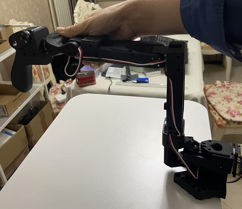

## [English](../../README.md)| 中文说明

lerobot_alohamini相较于原版lerobot，显著增强了调试能力，并适配了AlohaMini机器人硬件。

关于调试能力，具体参看：
[debug命令汇总](3_debug命令汇总.md)


## 前言
lerobot_alohamini是从lerobot仓库fork的一个分支，其保留了lerobot的全部代码，并增加了debug目录、AlohaMini相关的配置文件和教程文档。


请注意，本教程以AlohaMini Solo（1主1从）为样例。


## 开始使用（Ubuntu系统）

*** 强烈建议按顺序进行 ***

### 1. 准备工作，网络环境测试
```
curl https://www.google.com
curl https://huggingface.co
```
首先确保网络通畅


### 2. 克隆lerobot_alohamini仓库

```
cd ~
git clone https://github.com/liyitenga/lerobot_alohamini.git
```

### 3. 串口授权
默认权限无法访问串口，我们需要对端口进行授权，lerobot官方文档的案例是将串口权限修改为666，实践中发现每次重启电脑都要重新设置，非常麻烦，建议直接将当前用户添加到设备用户组，永久解决该问题。
1. 终端键入`whoami`  //查看当前用户名
2. 键入`sudo usermod -a -G dialout username` //永久添加username到设备用户组
3. 重启电脑，以让权限生效

### 4. 安装conda3及环境依赖

安装conda3
```
mkdir -p ~/miniconda3
wget https://repo.anaconda.com/miniconda/Miniconda3-latest-Linux-x86_64.sh -O ~/miniconda3/miniconda.sh
bash ~/miniconda3/miniconda.sh -b -u -p ~/miniconda3
rm ~/miniconda3/miniconda.sh
~/miniconda3/bin/conda init bash
source ~/.bashrc
```

初始化conda3
```
conda create -y -n lerobot_alohamini python=3.10
conda activate lerobot_alohamini
```

安装环境依赖
```
cd ~/lerobot_alohamini
pip install -e ".[feetech]"

conda install -y -c conda-forge ffmpeg
pip uninstall -y opencv-python
conda install -y -c conda-forge "opencv>=4.10.0"

pip install -e ".[aloha, pusht]"
```

### 5. 配置机械臂端口号
将机械臂连接好电源，并通过USB与电脑相连，查找机械臂的端口号。

方法1：
通过脚本查找端口：
```
cd ~/lerobot_alohamini

python lerobot/scripts/find_motors_bus_port.py
```

方法2：
可以在终端直接输入命令，根据每次插入后显示的端口号的不同，来依次确认插入的端口号

```
ls /dev/ttyACM*
```

**查找到正确的端口后，请修改lerobot/common/robot_devices/robots/configs.py文件，找到So100RobotConfig，将port值改为相应的端口号。**

注：每次重新插拔机械臂或重启电脑后，都要执行该操作

### 6. 配置摄像头端口号

第一步： 运行如下命令，会自动调取摄像头进行拍照，在outputs目录生成诸如camera_06_frame_000002.png这样的文件，这里面的6就是摄像头序号
```
python lerobot/common/robot_devices/cameras/opencv.py \
    --images-dir outputs/images_from_opencv_cameras

```

注意：
- 多个摄像头不能插在一个Hub上，1个Hub上仅支持1个摄像头
- 笔记本电脑通常都自带一个默认摄像头，这个摄像头我们用不上，忽略掉它即可
- 每次重新插拔或重启电脑后，都要执行该操作


第二步： 修改lerobot/common/robot_devices/robots/configs.py，找到So100RobotConfig，修改配置为正确的摄像头序号，配置文件里默认只启用了部分摄像头，如需启用更多摄像头，依照格式添加即可。


### 7. 摇操校准及测试


#### 7.1设置机械臂中位


  
将机械臂摆放到如图姿态，然后执行debug函数：

//重置当前位置为电机中位
```
python lerobot/debug/motors.py reset_motors_to_midpoint \
  --port /dev/ttyACM0
```

#### 7.2摇操校准

摇操校准一共有两种方式：

- 方式1：使用出厂自带的校准文件（推荐）：
  直接将.cache/calibration/am_solo_bk文件夹改名为am_solo即可


- 方式2：如果您不满意出厂自带的校准文件，可以手工进行摇操校准：

```
python lerobot/scripts/control_robot.py \
  --robot.type=so100 \
  --robot.cameras='{}' \
  --control.type=calibrate 
```

具体步骤可参考：
https://www.bilibili.com/video/BV1UDcbesEc3/?vd_source=a8dcb8b283f495e4a6a39594ac0cc22e


#### 7.3摇操测试
当插好机械臂和摄像头，并确认端口号无误后，我们就可以进行摇操测试了

运行代码：

```
  python lerobot/scripts/control_robot.py \
  --robot.type=so100 \
  --control.type=teleoperate
```
我们将看到摄像头窗体，并且Leader臂和Follower臂可以联动了，如果出现故障，可以先用下面的参数屏蔽摄像头，然后寻找原因：

```
  python lerobot/scripts/control_robot.py \
  --robot.type=so100 \
  --robot.cameras='{}' \
  --control.type=teleoperate
```
### 8. 本机评估测试
运行这个测试，以确认硬件驱动和lerobot环境没有问题

使用CPU评估：
```
python lerobot/scripts/eval.py \
    --policy.path=lerobot/diffusion_pusht \
    --env.type=pusht \
    --eval.batch_size=10 \
    --eval.n_episodes=10 \
    --use_amp=false \
    --device=cpu
```

使用cuda评估
```
python lerobot/scripts/eval.py \
    --policy.path=lerobot/diffusion_pusht \
    --env.type=pusht \
    --eval.batch_size=10 \
    --eval.n_episodes=10 \
    --use_amp=false \
    --device=cuda

```

不同硬件的耗时参考如下：
- macos i7 model-cpu  1178s
- ubuntu i7m model-cpu 2427s
- macos M1 model-mps  706s
- macos M1 model-cpu  3237s
- ubuntu i7m+4070M model-cuda 228s


### 9. 收集训练集

#### 1 注册huggingface，获取并配置key

1.进入HuggingFace网站（huggingface.co），申请{Key}，记得带读写权限

2.将API token添加到Git凭据中

```
git config --global credential.helper store

huggingface-cli login --token {key}--add-to-git-credential

```

#### 2 运行脚本

修改repo-id参数，然后执行：

```
HF_USER=$(huggingface-cli whoami | head -n 1)
echo $HF_USER

  python lerobot/scripts/control_robot.py \
  --robot.type=so100 \
  --control.type=record \
  --control.fps=30 \
  --control.single_task="so100_pick_taffy" \
  --control.repo_id=$HF_USER/so100_pick_taffy10\
  --control.tags='["so100","so100_pick"]' \
  --control.warmup_time_s=5 \
  --control.episode_time_s=60 \
  --control.reset_time_s=10 \
  --control.num_episodes=22 \
  --control.push_to_hub=true \
  --control.resume=false

```
参数：
* --resume  //是否续传数据集
* --push_to_hub  //数据集是否上传
* --repo_id //指定数据集的远程目录


### 10. 可视化
```
python lerobot/scripts/visualize_dataset_html.py \
  --repo-id $HF_USER/so100_bi_test
```


### 11. 重新播放数据集
```
python lerobot/scripts/control_robot.py \
  --robot.type=so100 \
  --control.type=replay \
  --control.fps=30 \
  --control.repo_id=$HF_USER/so100_bi_test\
  --control.episode=0
```

### 12. 本地训练
//act

```
python lerobot/scripts/train.py \
  --dataset.repo_id=liyitenga/so100_pick_taffy10  \
  --policy.type=act \
  --output_dir=outputs/train/so100_pick_taffy10_act  \
  --job_name=so100_pick_taffy10_act \
  --policy.device=cuda \
  --wandb.enable=false
```

//diffusion policy

```
python lerobot/scripts/train.py \
  --dataset.repo_id=liyitenga/so100_pick_taffy10  \
  --policy.type=diffusion \
  --output_dir=outputs/train/so100_pick_taffy10_diffusion  \
  --policy.device=cuda \
  --wandb.enable=false
```

参数：
* --dataset.root=data/so100_pick_taffy10   //训练数据地址

### 13. 远程训练
以AutoDL为例：
申请一张4070显卡，容器镜像选择Python  3.8(ubuntu20.04) Cuda  11.8或以上，并用终端登录
```
//进入远程终端，初始化conda
conda init

//重启终端，创建环境
conda create -y -n lerobot python=3.10
conda activate lerobot

//学术加速
source /etc/network_turbo

//获取lerobot
git clone https://github.com/liyitenga/lerobot_alohamini.git

//安装必要文件
cd ~/lerobot_alohamini
pip install -e ".[feetech,aloha,pusht]"
```


运行如下命令，开始训练：

```
python lerobot/scripts/train.py \
  --dataset.repo_id=liyitenga/so100_pick_taffy10  \
  --policy.type=act \
  --output_dir=outputs/train/so100_pick_taffy10_act  \
  --job_name=so100_pick_taffy10_act \
  --policy.device=cuda \
  --wandb.enable=false


```


最后安装FileZilla，将训练好的文件取回
````
sudo apt install filezilla -y
````

### 14. 评估训练集

用filezilla将训练好的模型拷贝到本地，并运行如下命令即可：

```
  python lerobot/scripts/control_robot.py \
  --robot.type=so100 \
  --control.type=record \
  --control.fps=30 \
  --control.single_task="Grasp a faffy and put it in the bin." \
  --control.repo_id=liyitenga/eval_so100_pick_taffy10_3 \
  --control.tags='["tutorial"]' \
  --control.warmup_time_s=5 \
  --control.episode_time_s=60 \
  --control.reset_time_s=30 \
  --control.num_episodes=2 \
  --control.push_to_hub=false \
  --control.policy.path=outputs/train/so100_pick_taffy10_act/checkpoints/100000/pretrained_model
  
````

